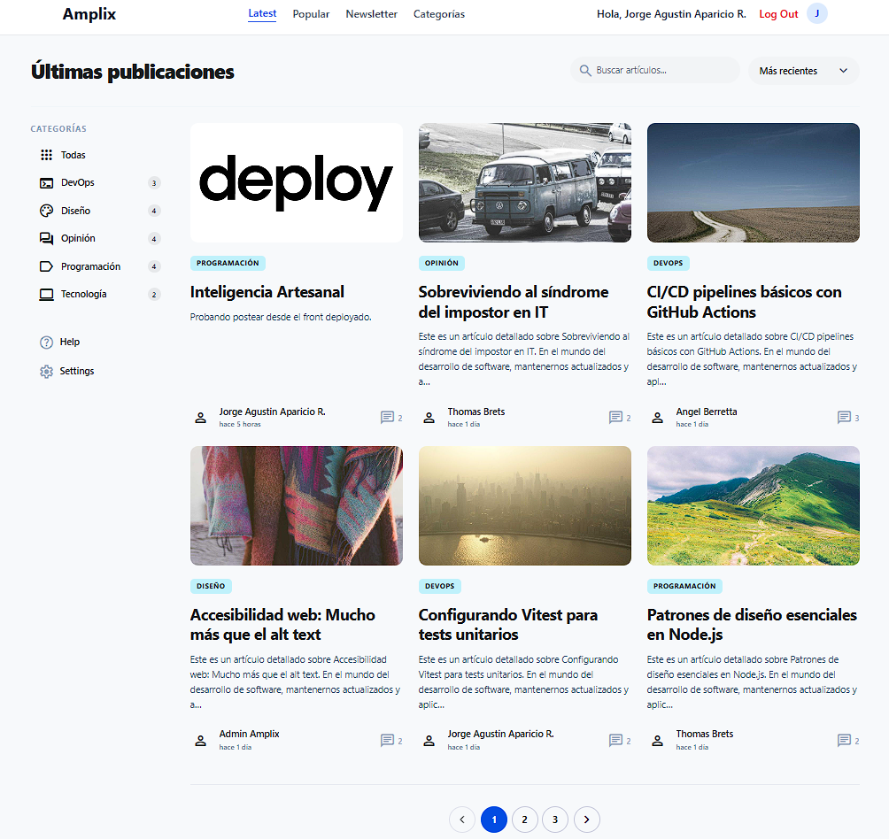
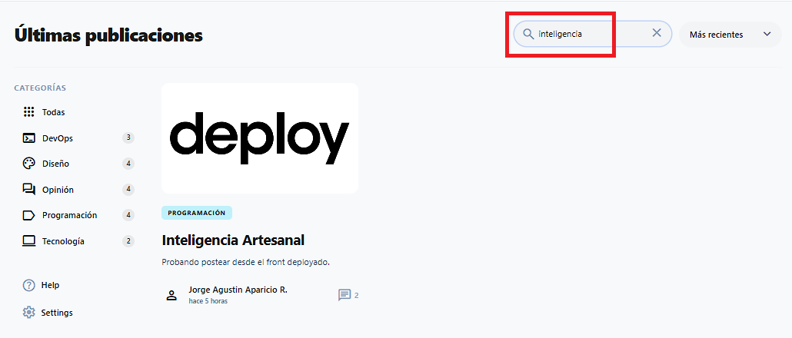
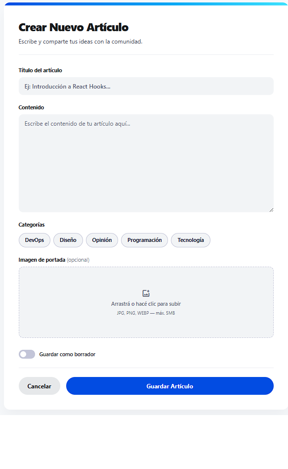
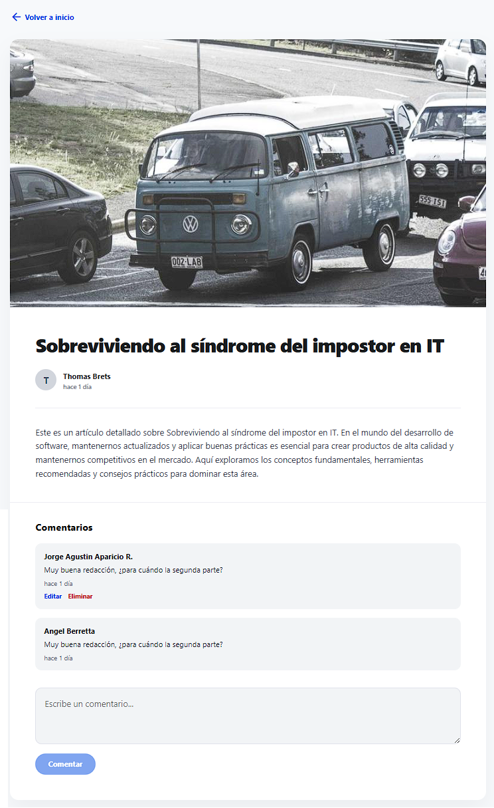
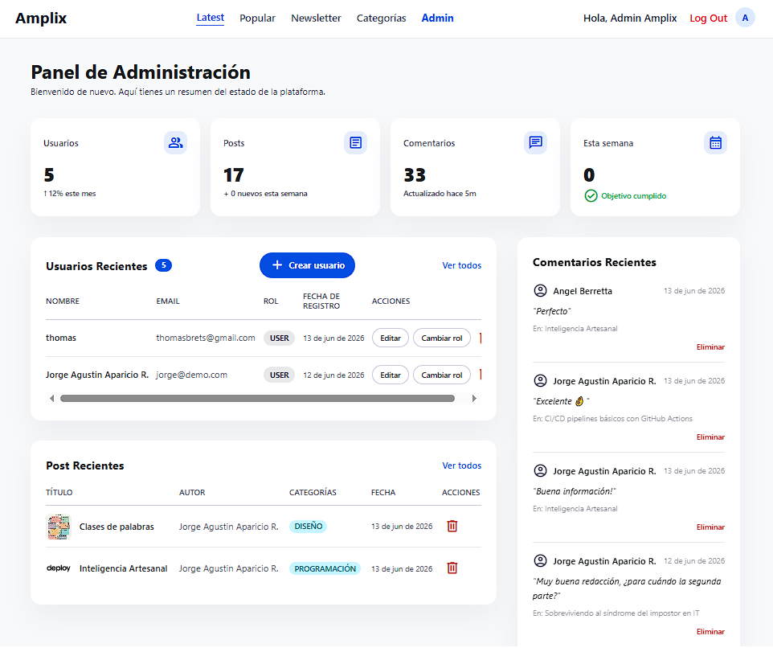
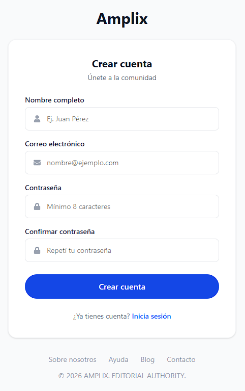

# FS-0002 — Amplix Blog

## 📖 Descripción

Amplix es una aplicación web de blog de noticias y contenido tecnológico. Los usuarios pueden registrarse, publicar artículos, comentar y reaccionar al contenido de otros. La plataforma incluye un sistema de autenticación con roles diferenciados: los administradores pueden gestionar y moderar contenido, mientras que los usuarios cuentan con un perfil que centraliza sus publicaciones e interacciones.

El contenido está organizado por categorías temáticas (Programación, Diseño, Testing, DevOps) y puede filtrarse para facilitar la navegación.

---

## 🛠️ Tech Stack

| Capa                  | Tecnología                     |
|-----------------------|--------------------------------|
| Frontend              | React + Vite                   |
| Backend               | Node.js + Express              |
| Base de datos         | Prisma Postgres (nube)         |
| ORM                   | Prisma + Prisma Accelerate     |
| Auth                  | JWT (JSON Web Tokens)          |
| Estilos               | Tailwind CSS / CSS Modules     |
| Almacenamiento        | Cloudinary                     |
| Control de versiones  | Git (GitHub Flow)              |

---

## 📸 Screenshots

### 🔐 Login


---

### 🏠 Página Principal


---

### 🔍 Filtro de Búsqueda


---

### 📝 Creación de Post


---

### 🗒️ Detalle de Post


---

### ⚙️ Dashboard Admin


---

### 🗂️ Administración de Categorías


---

### 👤 Creación de Usuario


---

## 📋 Requisitos previos

- [Node.js](https://nodejs.org/) v24.16 LTS
- [Git](https://git-scm.com/)

---

## 🔐 Variables de entorno

Antes de instalar, pedile al equipo los archivos `.env` correspondientes y ubicalos en:

- `backend/.env`
- `frontend/amplix-blog/.env`

---

## 🚀 Instalación y configuración

### 1. Clonar el repositorio

```bash
git clone https://github.com/amplixme/FS-0002.git
cd FS-0002
```

---

### 2. Backend

```bash
cd backend
npm install
npm run dev
```

Servidor disponible en: `http://localhost:3000`

---

### 3. Frontend

Abrí una nueva terminal desde la raíz del proyecto:

```bash
cd frontend/amplix-blog
npm install
npm run dev
```

Frontend disponible en: `http://localhost:5173`

---

## 📁 Estructura del proyecto
FS-0002/

├── backend/

│   ├── prisma/

│   │   └── migrations/

│   └── src/

│       ├── tests/

│       ├── config/

│       ├── controllers/

│       ├── generated/

│       │   └── prisma/

│       ├── middlewares/

│       ├── routes/

│       ├── schemas/

│       ├── services/

│       └── utils/

├── frontend/

│   └── amplix-blog/

│       ├── public/

│       └── src/

│           ├── tests/

│           ├── components/

│           │   ├── admin/

│           │   ├── categories/

│           │   ├── comments/

│           │   ├── common/

│           │   └── profile/

│           ├── context/

│           ├── hooks/

│           ├── pages/

│           ├── services/

│           └── utils/

└── README.md

---

## 🌐 Producción

| Entorno            | URL                                                                                   |
|--------------------|---------------------------------------------------------------------------------------|
| **Frontend**       | [https://amplix-blog.vercel.app](https://amplix-blog.vercel.app)                      |
| **API Backend**    | [https://amplix-blog-api.onrender.com](https://amplix-blog-api.onrender.com)          |
| **Health Check**   | [https://amplix-blog-api.onrender.com/api/health](https://amplix-blog-api.onrender.com/api/health) |
| **API Docs**       | [https://amplix-blog-api.onrender.com/api-docs](https://amplix-blog-api.onrender.com/api-docs) |

> ⚠️ **Free tier de Render**: el primer request tras inactividad puede tardar ~30s (cold start).

---

## ❓ Problemas comunes

**Puerto en uso**
Cambiá el valor de `PORT` en el `.env` o terminá el proceso que ocupa ese puerto.

**Token inválido**
Asegurate de que el `.env` tenga el `JWT_SECRET` correcto provisto por el equipo.

**Error de conexión a la base de datos**
Verificá que el `.env` contenga la `DATABASE_URL` correcta provista por el equipo.